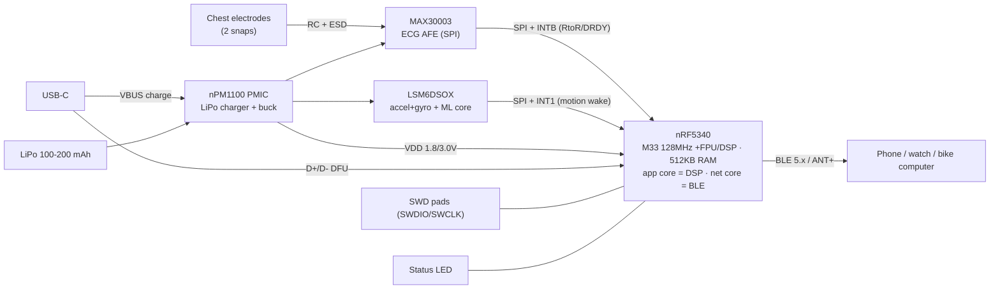

# Ultimate Belt — v2 hardware design

A ground-up successor to the reflashed Decathlon strap: a wearable **ECG + HRV +
motion** platform strong enough for real signal processing (wavelet / accel-
referenced adaptive filtering, on-device activity ML), while staying low power
and BLE/ANT+ native. The current Zephyr firmware (HR/RR, raw ECG, accel, steps,
motion-wake, dual connection) ports over almost unchanged.

## Design goals
- Clean ECG via a real AFE (not a discrete op-amp) → better HRV, motion tolerance.
- MCU with FPU + DSP + RAM for wavelet / LMS-RLS adaptive filtering and ML.
- 6-axis IMU (accel **+ gyro**) as the motion reference for artifact removal, and
  for cadence/activity.
- Rechargeable (LiPo + USB-C), or a coin-cell variant.
- Reuse the fabric chest-strap electrodes.

## Block diagram


Plain-text version:
```
electrodes -RC/ESD-> MAX30003 (ECG AFE) --SPI+INT--> nRF5340 --BLE/ANT+-> hosts
                     LSM6DSOX (IMU)      --SPI+INT-->   |
USB-C -> nPM1100 (charge+buck) -> 1.8/3.0V rails ------>+  (+ AFE, IMU)
LiPo  -> nPM1100                          SWD pads -----+  LED
```

## Bill of materials (core)
| Ref | Part | Role | Why |
|---|---|---|---|
| U1 | **nRF52840** module (E73/Raytac, ~$3-6) *or* **nRF5340** (~$8-12) | MCU + BLE 5.x + ANT+ | nRF52840: M4F @64 MHz, **FPU**, 256 KB RAM — plenty for single-channel ECG DSP (wavelet/LMS) and cheap. nRF5340: dual-core M33 (128 MHz FPU+DSP, 512 KB) if you want the radio on a separate core / ML headroom. Both Zephyr-native → our code ports over. **Module = no RF tuning, pre-certified.** |
| U2 | **AD8232** / AD8233 (~$2-4) *or* **MAX30003** (~$5-8) | ECG AFE | **Key insight: with a DSP-capable MCU, the digital filtering lives in firmware — so a cheap ANALOG AFE is the smart pick.** AD8232 = in-amp + configurable HP/LP + right-leg drive (50 Hz common-mode) + lead-off, analog out → MCU SAADC. Handles 3 of the 4 noise sources in hardware, far better than a discrete op-amp, a fraction of the MAX30003 cost. MAX30003 only wins when you want a *low-power* MCU that offloads DSP (not our case). Note: AD8232 is optimized for 3-electrode; a 2-electrode chest strap loses some RLD 50 Hz rejection → covered by the software notch. |
| U3 | **LSM6DSOX** | 6-axis IMU (accel+gyro) + ML core | Gyro gives a proper motion reference for adaptive artifact removal; embedded step/tilt + a **machine-learning core** for on-device activity classification. (SC7A20 is accel-only.) |
| U4 | **nPM1100** | PMIC: LiPo charger + buck regulator | Nordic's companion PMIC — USB-C charging + efficient buck for the rails. Tiny, made for nRF wearables. |
| BT1 | LiPo 100–200 mAh | Battery | Rechargeable, more headroom than CR2032 for the AFE+DSP. |
| J1 | USB-C receptacle | Charge + DFU | Charging (to nPM1100 VBUS) and USB DFU/serial (to nRF5340 USB). |
| — | 2× electrode snaps + RC/ESD | ECG front end | Reuse the fabric strap; RC anti-alias + TVS/ESD to the AFE inputs. |
| DS1 | LED | Status | wake/heartbeat/charge indication. |
| — | decoupling, RC filters, matching (if bare chip) | passives | per datasheets. |

**Coin-cell variant:** drop U4+BT1+J1, run everything from a CR2032 through a
low-Iq LDO; simplest, but tighter energy budget with the AFE always on. The
rechargeable LiPo path is the "ultimate" choice.

### Cost tiers
| | Value pick (cheap) | No-compromise |
|---|---|---|
| MCU | nRF52840 module (~$3-6) | nRF5340 (~$8-12) |
| ECG AFE | **AD8232** analog (~$2-4) | MAX30003 digital (~$5-8) |
| IMU | LSM6DSO accel+gyro (~$3) | LSM6DSOX (+ML core) |
| Power | CR2032 + LDO | LiPo + nPM1100 + USB-C |

**Recommended value build: nRF52840 + AD8232 + LSM6DSO** — the DSP lives in the
MCU (that's why we pay for the FPU), so a cheap analog AFE is the right call.

## Key connections
| Bus / signal | From → To | Notes |
|---|---|---|
| **ECG SPI** | MAX30003 ↔ nRF5340 (SCK/MOSI/MISO/CSB) | dedicated SPIM |
| **AFE INTB** | MAX30003 → nRF5340 GPIO | R-to-R / FIFO-ready interrupt |
| **IMU SPI** (or I²C) | LSM6DSOX ↔ nRF5340 | can share the SPI bus with a 2nd CSB |
| **IMU INT1** | LSM6DSOX → nRF5340 GPIO (sense-wake) | **motion-wake from System OFF**, same trick as v1 (P0.14) |
| **USB** | USB-C D+/D- → nRF5340 | DFU + serial |
| **VBUS** | USB-C → nPM1100 | charging |
| **Rails** | nPM1100 → VDD (MCU 1.8–3.0 V; AFE analog 1.8 V) | keep AFE analog quiet (separate/filtered) |
| **SWD** | SWDIO/SWCLK pads → nRF5340 | or a Tag-Connect footprint (no more hair-wire soldering!) |

## Firmware plan (reuse v1)
- Zephyr on the nRF5340 **app core**; BLE/ANT on the **net core** (Nordic's split image). Our services (HR/RR, raw ECG, accel+steps) drop in.
- **MAX30003 driver over SPI**: stream the ECG FIFO into the app core; keep its
  hardware R-to-R as a low-power/no-DSP fallback.
- With FPU + 512 KB: real **wavelet (DWT) QRS**, and the **LSM6DSOX gyro/accel as
  the reference input to an LMS/RLS adaptive filter** to subtract motion artifact
  during exercise (the thing the nRF52805 couldn't do).
- **Motion-wake**: LSM6DSOX INT1 → GPIO sense → System OFF, exactly like the v1
  SC7A20/P0.14 mechanism.
- **OTA firmware update over BLE** — MCUboot (dual-slot) + MCUmgr/SMP-over-BLE
  (push with the *nRF Device Manager* app). Configs: `CONFIG_BOOTLOADER_MCUBOOT`,
  `CONFIG_MCUMGR`, `CONFIG_MCUMGR_TRANSPORT_BT`, `CONFIG_MCUMGR_GRP_IMG/OS`, plus
  `boot`/`slot0`/`slot1` flash partitions. **This is a v2-only feature:** it needs
  bootloader + two full app slots, which fit trivially in the 1 MB flash but
  **not** in the nRF52805's 192 KB (~109 KB app leaves no room for a 2nd slot).
  → v1 stays SWD-only, v2 is field-updatable.
- Optional: LSM6DSOX **MLC** for onboard activity/gesture classification.

## Open decisions
1. **Module vs bare nRF5340** — module (Raytac/Fanstel) is far easier for a first
   spin (no antenna/matching, certified); bare chip is smaller/cheaper at volume.
2. **MAX30003 (1-ch, wearable-optimized) vs ADS1292R (2-ch, 24-bit, respiration
   via bio-Z)** — MAX30003 for pure ECG/HRV; ADS1292R if you want a 2nd channel or
   impedance-respiration.
3. **LiPo + nPM1100 vs CR2032 + LDO** — rechargeable vs simplest.
4. **Debug**: Tag-Connect footprint vs test pads.
5. Keep **ANT+** (net core supports it) for the bike/rowing computers that speak it
   — note: the old Mr. Rudolf rower needs **5 kHz analog**, which none of this
   emits; that receiver is legacy-analog-only.

## Next steps
- Pick module vs bare + AFE choice → freeze the core BOM.
- Draw the schematic (KiCad), starting from the nRF5340, MAX30003 and nPM1100
  reference designs / EVKs.
- Prototype the DSP on an **nRF5340-DK + MAX30003 EVK** first (no PCB spin), port
  the v1 firmware, validate wavelet + accel-referenced motion filtering, then lay
  out the belt PCB.
